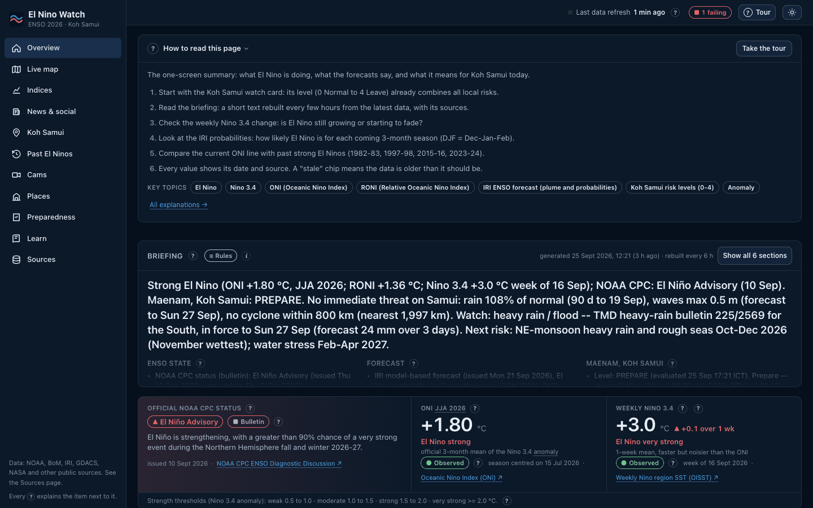
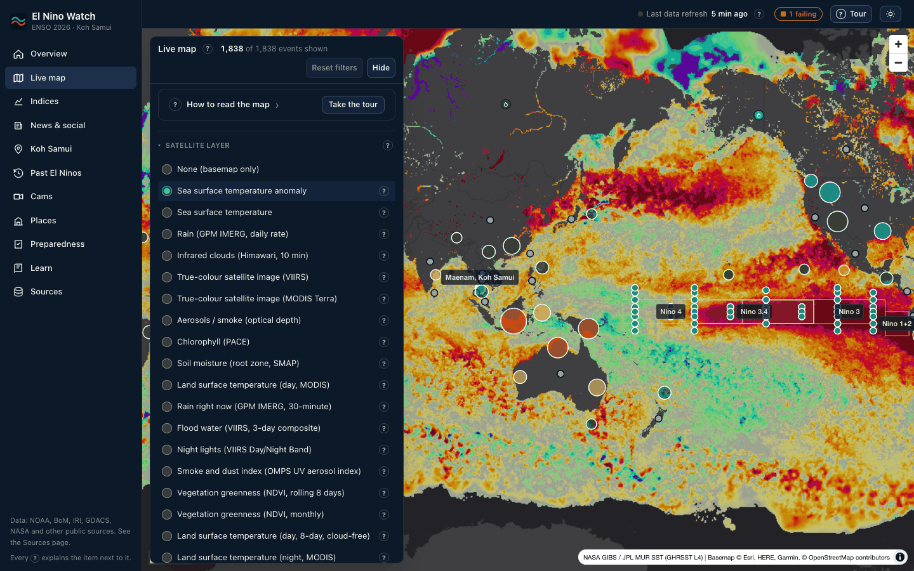
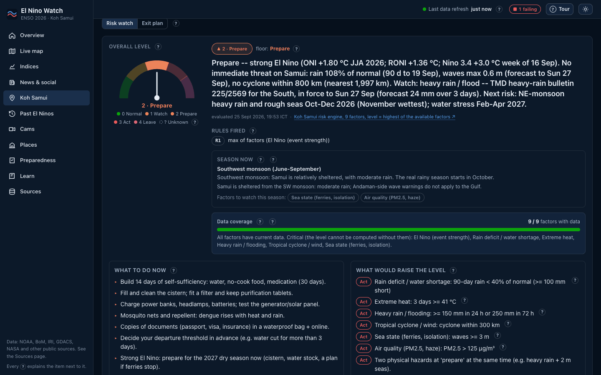
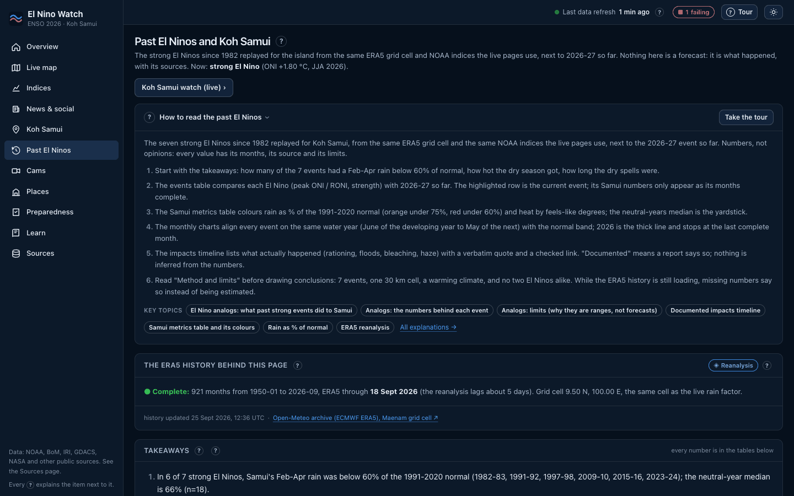
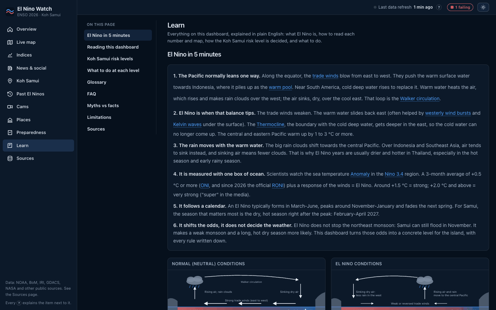
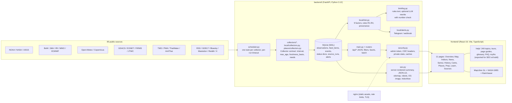

<p align="center">
  
</p>

<h1 align="center">El Nino Watch</h1>

<p align="center">
  <strong>Live El Nino (ENSO) tracker with an explainable, sourced risk watch for Koh Samui, Thailand.</strong><br>
  <sub>85 free public data sources. Every number carries its date, its source link and a plain-English explanation. No fabricated data, no black-box score.</sub>
</p>

<p align="center">
  <a href="https://elnino.soclose.co"></a>
  <a href="LICENSE"></a>
  <a href="https://github.com/SoCloseSociety/elnino-watch/actions/workflows/ci.yml"></a>
  
  
</p>

<p align="center">
  
  
  
  
  
  
</p>

<p align="center">
  <a href="https://elnino.soclose.co"></a>
</p>

---

A strong El Nino is under way in 2026-27. **El Nino Watch** follows it in real time and answers a
practical question for one island in the Gulf of Thailand: *how is the El Nino going, and what
does it mean for Koh Samui this season?* It collects the official ENSO indices and bulletins,
seasonal forecasts, ocean buoys, satellite products, disaster alerts, Thai agency warnings,
news and social posts; turns the local signals into a **five-level risk watch** (normal,
vigilance, prepare, act, leave) where every factor shows its value, threshold, source and
explanation; writes a plain-English briefing; and explains all of it in a 240-topic Learn
section written for people who are not meteorologists.

It was built for the residents of one island, then opened up. Point it at another place with
three environment variables and the same engine, map, charts and help system work there.

> **Not an official warning service.** El Nino Watch aggregates public data and applies
> written-down rules. For decisions that affect your safety, follow the Thai Meteorological
> Department, the Provincial Waterworks Authority, your local authorities and the ferry and
> airline operators. See [Limitations and disclaimer](#limitations-and-disclaimer).

## Contents

- [Features](#features)
- [Screenshots](#screenshots)
- [How the risk levels work](#how-the-risk-levels-work)
- [Data sources](#data-sources)
- [Architecture](#architecture)
- [Quick start (local)](#quick-start-local)
- [Configuration](#configuration)
- [Deploy (public site)](#deploy-public-site)
- [API overview](#api-overview)
- [The help and Learn system](#the-help-and-learn-system)
- [Alerts and bot integration](#alerts-and-bot-integration)
- [Limitations and disclaimer](#limitations-and-disclaimer)
- [Contributing](#contributing)
- [Credits](#credits)
- [License](#license)

## Features

- **Live ENSO state.** ONI and RONI (NOAA CPC), weekly and daily Nino 1+2 / 3 / 3.4 / 4, SOI
  (CPC and BoM), MEI.v2, warm water volume, heat content, trade winds, OLR, MJO, Indian Ocean
  Dipole, world SST, and the official CPC, IRI, JMA, ECMWF and WMO outlooks and probabilities.
  214 series, all with the period they describe and a link to the file they came from.
- **Live map** (MapLibre GL). 1,800+ geolocated events (GDACS, NASA EONET, NASA FIRMS fires,
  Coral Reef Watch, USGS, JMA and JTWC cyclone tracks) with 22 satellite and radar layers
  from NASA GIBS and RainViewer: SST anomaly, rain (GPM IMERG), Himawari infrared, true colour,
  aerosols, chlorophyll, soil moisture, flood water, night lights, NDVI, land temperature,
  salinity. Date slider, legends, TAO/TRITON buoys, Nino boxes, home circle.
- **Koh Samui watch.** Nine factors (El Nino strength, rain deficit and water supply, extreme
  heat, heavy rain and flooding, tropical cyclone and wind, sea state for the ferries, air
  quality, coral heat stress, local news) combined by four written rules into one level, with
  "what to do now", "what would raise the level", data coverage, season logic and an **exit
  plan** view (ferry / air / road routes, 7-day sea windows, checklist).
- **Past El Ninos.** The seven strong events since 1982 replayed for the island from the same
  ERA5 grid cell and NOAA indices: rain as a percentage of normal by season, heat, dry spells,
  a neutral-year baseline, and 48 documented impacts (rationing, floods, bleaching, haze) each
  with a verbatim quote and a checked link.
- **Preparedness.** A sourced checklist (water, food, power, health, documents, evacuation)
  scaled to your household, scenarios, emergency contacts, and a shopping panel with prices
  seen on real retailer pages (no scraping at runtime).
- **Places.** Compare places side by side: current factors, 1991-2020 normals, seasonal
  outlook, CMIP6 projection to 2050, river discharge, earthquakes, fires, official warnings
  (Meteoalarm, Roshydromet, TMD) and travel advice (FCDO, US State, France Diplomatie).
- **Cams.** 101 verified public webcams (Samui, the ferry route, Thailand, ENSO regions, NOAA
  BuoyCAMs, Himawari / GOES) with liveness checks; owner-published feeds only.
- **Briefing.** Rebuilt every 6 hours from stored data by fixed rules, every number with its
  date; an optional LLM rewrite is rejected if it introduces a number the rules did not.
- **Freshness as data.** Each source declares how often it really updates and how old its
  newest data may be; stale, empty, failing and unconfigured sources are shown as such, never
  as zero or "normal". If critical data is missing the level is **unknown**, never "safe".
- **Public mode.** Admin token on every write, strict CSP and security headers, no API docs,
  bounded caches and upstream budgets, private household state, rate limits in nginx.
- **SEO-ready.** Server-rendered summary of the live data for crawlers, JSON-LD (Dataset,
  WebPage, FAQ, breadcrumbs), sitemap with real `lastmod`, robots, live Open Graph card,
  IndexNow.
- **Accessible.** Lighthouse accessibility 100 on every page; keyboard tours; every "?"
  explains the item next to it; no horizontal overflow from 360 px to 2560 px.

## Screenshots

| Overview | Live map (SST anomaly layer) |
|---|---|
| [](docs/screenshots/overview.png) | [](docs/screenshots/map-sst-anomaly.png) |

| Koh Samui watch | Past El Ninos |
|---|---|
| [](docs/screenshots/samui-watch.png) | [](docs/screenshots/past-el-ninos.png) |

| Learn |
|---|
| [](docs/screenshots/learn.png) |

Taken from the live site at 1440 px, dark theme (a light theme is one click away).

## How the risk levels work

The island level is the **highest of the available factors**, then adjusted by three more
rules. Everything is in `backend/app/local/risk.py` and explained on the Samui page and in
Learn ("How the overall level is decided").

| Level | Key | Meaning |
|---|---|---|
| 0 | normal | Nothing beyond the season's usual. |
| 1 | vigilance | One factor is moving; watch it. |
| 2 | prepare | Build 14 days of self-sufficiency, fill the cistern, charge everything. |
| 3 | act | A hazard is imminent or a shortage is real: act on the factor's instructions. |
| 4 | leave | Leaving the island is the safer option; the exit plan shows the windows. |
| ? | unknown | Critical data is missing. This is never shown as "no danger". |

Rules: **R1** level = max of factors; **R2** two physical hazards at "prepare" at the same time
raise the level by one; **R3** a strong El Nino sets a floor of "prepare" during the dry
season (the water risk builds slowly); **R4** if a critical factor has no current data, the
level is unknown. Each factor card shows the raw value, the threshold it crossed, the period
the value describes (`valid_for`), whether it is observed, a forecast, a model analysis, a
reanalysis or a bulletin (`kind`), when the agency issued it and when we fetched it. Nothing
is estimated: a missing input reads "no current data" with links to check by hand.

Alerts fire when the level rises, when any factor reaches "act", or when the level has been
unknown for more than 6 hours (a "data gap" alert), de-duplicated per kind, level and day.

## Data sources

85 collectors, all free and keyless unless noted, each polled at the rate its provider really
updates. The full table (collector, provider, interval, max age, credentials, licence notes)
is generated from the registry: **[docs/DATA_SOURCES.md](docs/DATA_SOURCES.md)**. The
Sources page of the app shows the same list live, with state, success rate and freshness.

| Domain | Providers |
|---|---|
| ENSO and climate indices | NOAA CPC, NOAA PSL, NOAA PMEL, Australian Bureau of Meteorology, JMA Tokyo Climate Center, Climate Reanalyzer (Univ. of Maine) on NOAA OISST, Copernicus C3S / ECMWF, NOAA NCEI, UK Met Office Hadley Centre, NASA GISS |
| Official bulletins and outlooks | NOAA CPC ENSO Diagnostic Discussion and probabilities, IRI / Columbia, JMA, WMO, ECMWF SEAS5 (open charts), NASA GMAO, NOAA climate.gov ENSO blog, NCEI monthly reports, ASMC seasonal outlook, Thai Meteorological Department |
| Ocean and sea state | NOAA NDBC / PMEL TAO-TRITON buoys, NOAA Coral Reef Watch, NOAA CoastWatch sea level, Open-Meteo Marine (Meteo-France MFWAM, ECMWF WAM) |
| Hazards | GDACS (EC JRC / UN OCHA), NASA EONET, NASA FIRMS, JMA RSMC Tokyo, US JTWC, USGS, NOAA PTWC, ASMC haze and hotspots, ThaiWater / HII and the Royal Irrigation Department, ReliefWeb |
| Satellite layers | NASA GIBS (MUR SST, GPM IMERG, Himawari, VIIRS, MODIS, PACE, SMAP, OMPS), RainViewer radar, NASA Worldview snapshots, NASA GRACE-FO drought, NASA Earthdata CMR |
| Koh Samui | Open-Meteo (forecast, ERA5 archive, CAMS air quality, SEAS5 seasonal), NASA POWER, ThaiWater rain gauges and dams, TMD warnings, PWA water-supply notices, Air4Thai (PCD) |
| Places | Open-Meteo (forecast, climate, air, marine, seasonal, CMIP6, GloFAS), USGS, NASA FIRMS, Meteoalarm, Hydrometcenter of Russia, UK FCDO, US Department of State, France Diplomatie |
| News and social | GDELT, Google News RSS, agency and press RSS (NOAA, NASA, Copernicus, Carbon Brief, Bangkok Post, The Thaiger, Thairath ...), YouTube channel RSS, newsletters, Bluesky, Mastodon, Reddit, X, public Telegram channels |
| Webcams | NOAA BuoyCAMs, JMA MSC, NOAA NESDIS STAR, venue YouTube streams, SkylineWebcams (link only), Windy Webcams API (key) |

**The data belongs to its providers and stays under their terms.** NOAA, NASA, USGS and
other US Government products are public domain; Open-Meteo is CC BY 4.0; Copernicus and
ECMWF open charts carry the Copernicus licence / CC BY 4.0; the Thai agencies, JMA, BoM,
IRI, WMO, GDACS and the news and social platforms each have their own terms. The app stores
titles, values, dates and links, never full articles, and identifies itself with a
User-Agent so providers can reach the operator. Details and per-provider notes:
[docs/DATA_SOURCES.md](docs/DATA_SOURCES.md#licence-and-terms-notes-per-provider-family).

## Architecture



- **Backend**: Python 3.12, FastAPI, httpx, `sqlite3` from the standard library (WAL, one
  connection behind a lock), `uv` for dependencies. One uvicorn worker: the scheduler runs in
  process. 470+ tests with `respx` fixtures captured from the real providers; none touches the
  network.
- **Frontend**: React 19, Vite 6, TypeScript, Tailwind 4, MapLibre GL, Recharts, TanStack
  Query. Built into `frontend/dist`, served by the API at `/` so a local install is one URL.
- **Retention**: bulletins and daily / monthly series are kept for good; hourly buoy series
  are folded to daily means after a year; news and social items go after 180 days; the DB is
  compacted weekly. The whole thing runs comfortably in 550 MB of RAM.

## Quick start (local)

Requirements: Python 3.12+, [uv](https://docs.astral.sh/uv/), Node 22+.

```bash
git clone https://github.com/SoCloseSociety/elnino-watch.git
cd elnino-watch
./start.sh              # builds the frontend if needed, starts the API + collectors
```

Open **http://127.0.0.1:8911**. The first collectors answer within a minute; monthly indices
and the ERA5 history fill in over the first hours (heavy requests are spread out on purpose to
respect Open-Meteo's free tier). `./start.sh status`, `./start.sh logs`, `./start.sh stop`.
On macOS, `./start.sh install` registers a launchd agent so it starts at login.

By hand:

```bash
cd backend && uv sync && uv run uvicorn app.main:app --port 8911     # API + collectors
cd frontend && npm ci && npm run dev                                 # dev server on 5211, proxies /api
```

Checks: `cd backend && uv run pytest -q && uv run ruff check app scripts tests`;
`cd frontend && npm run build`. To hit every source for real once:
`cd backend && uv run python scripts/verify_sources.py` (prints state and freshness per
source, exit 1 if any errors or serves stale data).

## Configuration

Settings are environment variables or a `.env` file at the repository root
(`backend/app/config.py`; names are case-insensitive). Everything is optional.

| Variable | What it does |
|---|---|
| `HOME_NAME`, `HOME_LAT`, `HOME_LON`, `HOME_RADIUS_KM` | The watched point (default: the centre of Koh Samui, 800 km radius). The local collectors, the risk engine, the map circle and "near" filters follow it. The frontend copy is set at build time with `VITE_HOME_NAME` / `VITE_HOME_LAT` / `VITE_HOME_LON` / `VITE_HOME_RADIUS_KM` in `frontend/.env.local`. |
| `CONTACT` | An email or URL appended to the User-Agent so data providers can reach you. |
| `PUBLIC_MODE`, `ADMIN_TOKEN` | Hardened mode for a public deployment (see below). |
| `PUBLIC_ORIGIN` | The one canonical origin (`https://elnino.example.com`) for canonical links, sitemap, Open Graph, JSON-LD, robots and IndexNow. |
| `GOOGLE_SITE_VERIFICATION`, `BING_SITE_VERIFICATION`, `INDEXNOW_KEY` | Search engine ownership proofs and instant indexing. |
| `SCHEDULER=false` | Run the API without the background collectors. |
| `DB_PATH`, `PORT` | Where the SQLite file lives; the port uvicorn listens on. |
| `BLUESKY_HANDLE`, `BLUESKY_APP_PASSWORD` | Full-network Bluesky search (the account feeds are keyless). |
| `X_BEARER_TOKEN` or `X_AUTH_TOKEN` + `X_CT0` | X via the official API or a cookie session; keyless fallbacks otherwise. |
| `FIRMS_MAP_KEY`, `WINDY_WEBCAMS_KEY`, `RELIEFWEB_APPNAME` | More fires detail, Windy webcams, ReliefWeb reports. |
| `TELEGRAM_BOT_TOKEN`, `TELEGRAM_CHAT_ID` | Alert delivery to a Telegram chat. |
| `NEO_API_URL`, `NEO_API_TOKEN` | Alert delivery to a generic webhook (`POST {url}/device_alert`, Bearer token). |
| `COMPUTEFORGE_KEY`, `COMPUTEFORGE_URL`, `BRIEFING_MODEL` | Optional LLM rewrite of the briefing (Anthropic Messages API shape); numbers are checked against the rules text. |

Without a credential the matching source shows `needs_config` on the Sources page, never a
silent zero.

## Deploy (public site)

`ops/deploy/` is a complete kit for a small Linux VPS (tested on Ubuntu, 2 vCPU, under 1 GB
for this service): a hardened systemd unit (`ProtectSystem=strict`, memory cap, single
worker), an nginx site template (static assets from `frontend/dist`, `/api` proxied with rate
limits, `index.html` always served by the app so it carries the CSP), logrotate, certbot, an
idempotent `first_setup.sh` and a `deploy.sh` that runs the tests and the build locally, then
rsyncs and restarts. The step-by-step guide is **[docs/DEPLOY.md](docs/DEPLOY.md)**.

What `PUBLIC_MODE=true` changes: every non-GET `/api` request needs `X-Admin-Token`; the
heavy "verify all sources" and "verify layers" GETs are admin-only; the preparedness state
(household numbers, ticks) is private, visitors keep theirs in their browser; `/docs`,
`/redoc` and `/openapi.json` are off; strict CSP, HSTS and the usual headers; bounded caches
and hourly upstream budgets on the places search / preview; the briefing and the layer list
are single-flight cached.

## API overview

Everything the dashboard shows is available as JSON under `/api` (read-only for visitors in
public mode). The full contract, including filters, facets, paging, batch series and the
provenance vocabulary, is in [AGENTS.md](AGENTS.md#api-contract).

| Endpoint | What |
|---|---|
| `GET /api/health` | Status, number of collectors, home name. |
| `GET /api/latest` | Latest **observed** point of every series (forecast rows excluded), with `kind`, `valid_for`, `tz`, `unit_label`, previous value. |
| `GET /api/series?source=&series=&since=&until=&downsample=` | One series; `GET /api/series/batch?keys=source:series,...` for many; `GET /api/series/catalog`. |
| `GET /api/status`, `GET /api/status/{key}` | Bulletins and derived documents (`cpc_alert`, `iri_plume`, `local_risk`, `briefing` ...). |
| `GET /api/local`, `/api/local/exit`, `/api/local/history`, `/api/local/weather`, `/api/local/analogs` | The Koh Samui watch: level, factors with inputs and provenance, actions, triggers, coverage; exit plan; history; local series; past El Ninos. |
| `GET /api/briefing` | The current briefing (`method: rules` or `llm`), sections with sources, text ready to send. |
| `GET /api/events?category=&severity=&near=&radius_km=&bbox=&paged=1` | Geolocated events with facets (`/api/events/facets`). |
| `GET /api/feed?kind=&source=&lang=&tag=&q=&since=` | News, official, social and research items with facets. |
| `GET /api/sources` | Every collector with state, last run, success rate, freshness and `expected_stale` notes. |
| `GET /api/alerts` | Alerts raised, newest first. |
| `GET /api/layers`, `/api/webcams`, `/api/places`, `/api/preparedness`, `/api/shopping/...` | Map layers, webcams, places, preparedness content, shopping offers. |

Cheap, cached endpoints (`/api/latest`, `/api/series`, `/api/status`, `/api/local`,
`/api/local/weather`, `/api/sources`) are also declared as `Dataset` distributions in the
pages' JSON-LD, so search engines can index them as open data.

## The help and Learn system

Rule 10 of this project: nothing ships without its explanation. Every source, series, status,
map layer, factor, filter and page has a help topic: what it is, how to read it (units,
colours, thresholds), why it matters for ENSO or for the island, its limits, and 1-3 checked
links. The 240 topics power the "?" buttons, the side drawer, the "How to read this page"
guides, the keyboard tours, the glossary and the `/learn` section ("El Nino in 5 minutes",
FAQ, myths vs facts, limitations, sources). They are also exported at build time so each
`/learn/<topic>` page is server-rendered for search engines. See
`frontend/src/help/README.md` to add one.

## Alerts and bot integration

Alerts are always stored and shown in the dashboard. With credentials they are also sent to
a Telegram chat and/or to a generic webhook (`POST {NEO_API_URL}/device_alert`, Bearer
token). Four read-only endpoints are enough for any assistant or bot to answer "how is the
El Nino going, and is Koh Samui OK?": [docs/BOT_CONNECTOR.md](docs/BOT_CONNECTOR.md)
documents them with ready-made tool definitions and guard-rails (quote dates and sources,
never turn "unknown" into "safe", never trigger source runs from a chat).

## Limitations and disclaimer

- **Not an official warning service.** This is an aggregator with written rules, run by
  volunteers. Official warnings for Koh Samui come from the Thai Meteorological Department,
  the Department of Disaster Prevention and Mitigation, the Provincial Waterworks Authority
  and the ferry and airline operators. Follow them first.
- **Forecasts are forecasts.** IRI, CPC, ECMWF and Open-Meteo products are labelled as such
  (`kind: forecast`) and never shown as current values. The past El Ninos page shows what
  happened in seven events on one 30 km grid cell; that is a range of precedents, not a
  prediction.
- **Thresholds are judgment calls.** They are documented next to each factor and in Learn;
  they are meant to be discussed and improved (open an issue).
- **Upstream outages are visible, not hidden.** A stale or failing source is shown as such,
  and the level becomes "unknown" if a critical input is missing.
- **Free tiers.** The public instance is rate-limited and shares Open-Meteo's free quota;
  heavy requests are spread out, so some pages fill over hours after a restart.
- **Third-party content** (news titles, posts, webcam frames) is shown as published by its
  source, in its original language, with a link; it is not fact-checked by this project.

## Contributing

Issues and pull requests are welcome, especially: a number that differs from its source (the
most valuable report), a new keyless data source, a threshold you can argue for with a
reference, a help topic that is unclear. Read [CONTRIBUTING.md](CONTRIBUTING.md) (the ground
rules are short) and [AGENTS.md](AGENTS.md) (the developer guide, also used by coding
agents). Security reports: [SECURITY.md](SECURITY.md). We follow the
[Contributor Covenant](CODE_OF_CONDUCT.md).

Reports from the last review campaign are in [docs/reports/](docs/reports/) (QA of the live
site at 7 widths and 2 themes, a senior code review, a precision audit of every displayed
value against its upstream).

## Credits

- **Data**: NOAA (CPC, PSL, PMEL, NDBC, Coral Reef Watch, NESDIS, NCEI, PTWC, climate.gov),
  NASA (EONET, FIRMS, GIBS, Worldview, POWER, GISS, GMAO, Earthdata, Earth Observatory),
  USGS, the Australian Bureau of Meteorology, the Japan Meteorological Agency, IRI / Columbia
  University, WMO, ECMWF and Copernicus (C3S, CAMS, GloFAS, ERA5), the UK Met Office Hadley
  Centre, Climate Reanalyzer (University of Maine), Open-Meteo, GDACS (EC JRC / UN OCHA),
  ReliefWeb, the US Joint Typhoon Warning Center, the ASEAN Specialised Meteorological Centre,
  the Thai Meteorological Department, the Provincial Waterworks Authority, ThaiWater / HII,
  the Royal Irrigation Department, Air4Thai / PCD, Meteoalarm, the Hydrometcenter of Russia,
  the UK FCDO, the US Department of State, France Diplomatie, GDELT, the news publishers and
  the scientists and agencies whose public posts are listed, and the webcam owners.
- **Maps**: MapLibre GL, NASA GIBS, RainViewer, OpenStreetMap contributors, Esri / HERE /
  Garmin basemap.
- **Stack**: FastAPI, httpx, pydantic, feedparser, Pillow, uv, ruff, pytest, respx, React,
  Vite, TypeScript, Tailwind CSS, Recharts, TanStack Query.
- Built by [SoClose](https://soclose.co) on Koh Samui with the help of coding agents; every
  displayed value was cross-checked against its upstream by hand during the audit of
  24 September 2026 (`docs/reports/`).

## License

The code is released under the [MIT License](LICENSE). The data belongs to its providers and
stays under their own terms (see the data notice in [LICENSE](LICENSE) and
[docs/DATA_SOURCES.md](docs/DATA_SOURCES.md)).
